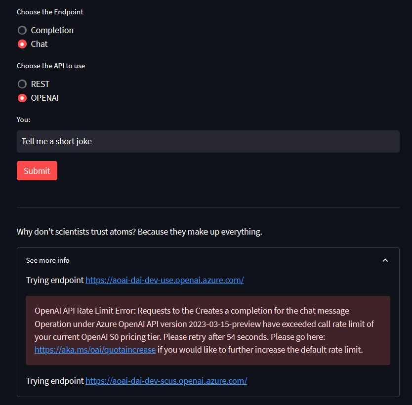
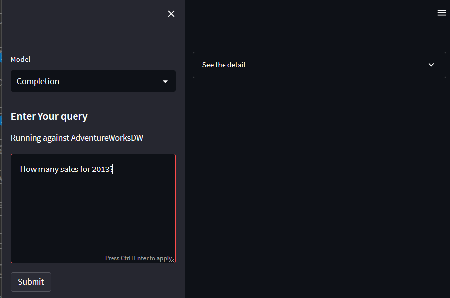
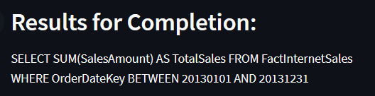
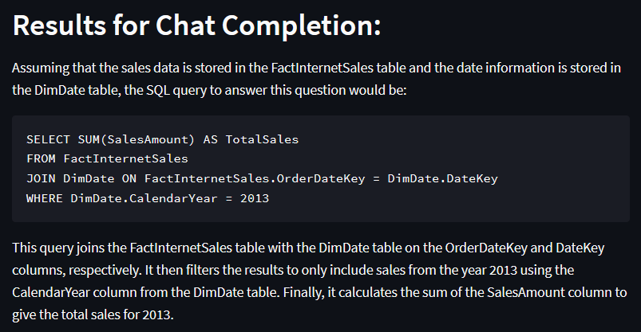
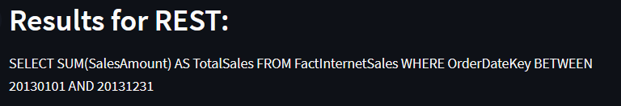
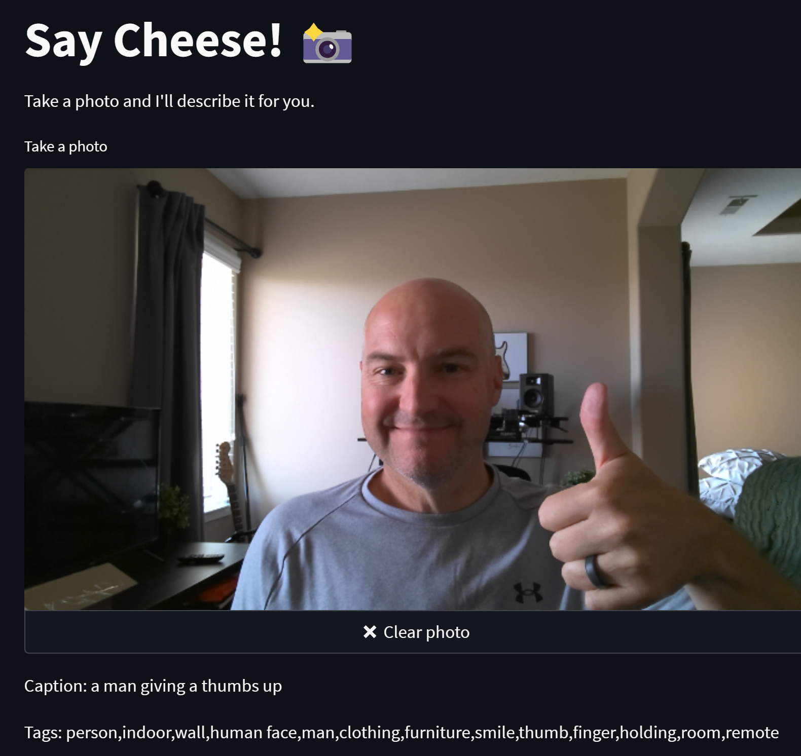

# Azure OpenAI Solutions
Will showcase several options here for different approaches

<!-- [](https://github.com/codespaces/new?hide_repo_select=true&ref=main&repo=599293758&machine=standardLinux32gb&devcontainer_path=.devcontainer%2Fdevcontainer.json&location=WestUs2) -->

## Azure OpenAI Subscription
Several assumptions on this part here:
1. Azure OpenAI subscription
    - Request here: https://aka.ms/oai/access 
    > NOTE: To get access soon, do NOT include DALL-E
1. Your deployment names are like the following
    - `gpt-35-turbo`
    - `code-davinci-002`
        > Yes I know this is going away and will update to ONLY use gpt going forward
    - `text-davinci-003`
1. Optional: Search Service
    - With Semantic search enabled
1. Optional: [Bing Search](#bing-it)
1. Optional: [SQL Database either local or in Azure](#nlp-with-azure-sql-using-openai)
1. `.env` config needed for python and PowerShell
    ```text
    AOAI_NAME={Name of the resource in azure}
    AOAI_KEY={Key of the OpenAI resource}
    AOAI_ENDPOINT=https://{Name of the resource in azure}.openai.azure.com/

    AZURE_SEARCH_SERVICE={Cognitive Search Service name}
    AZURE_SEARCH_INDEX={Name of the index with the content}
    AZURE_SEARCH_KEY={API Key needed for search}

    BING_KEY={Bing search key}
    BING_ENDPOINT=https://api.bing.microsoft.com/

    SQL_DB_NAME=AdventureWorksDW
    SQL_SERVER=127.0.0.1
    SQL_USER=sa
    SQL_PASSWORD={whatever your password is}
    ```
1. `.streamlit\secrets.toml` needed for streamlit

## Load Balance with Azure OpenAI and 429 RateLimit
- [Learn streaming with the endpoints](https://github.com/avrabyt/OpenAI-Streamlit-YouTube/blob/451de7a5b9b2cfcd55ff828e0ddb213f2274cf8e/Stream-Argument/app.py)
- At minimum create the environment variables
    - Set the `OPENAI_API_BASE` and the `OPENAI_API_KEY` environment variables at minimum
- OR: Create a `json.env` file with the content like below
    ```json
    [
        {"endpoint":"https://openairesource1.openai.azure.com/","key":"999aaa9999"},
        {"endpoint":"https://openairesource2.openai.azure.com/","key":"999aaa9999"}
    ]
    ```
- Launch `chat.py` with streamlit `streamlit run chat.py`
- Retry over and over against an interface and it will automatically load balance to another endpoint

This error shows two tries and it switches from one endpoint to another without the user even knowing


## PowerShell with REST API
This is a big [script](aoai.ps1) of goodness. Run it (F5) and then just run the same sections later in the script after the `return`

Must have:
- Permissions to run scripts
    - `Set-ExecutionPolicy -Scope Process -ExecutionPolicy Bypass`
- Optional: PowerShell SQL Server module
    ```powershell
    $mod = (Get-Module SqlServer -ListAvailable)
    
    if( $mod -eq $null -or $mod.Version.Major -lt 21 )
    {
        Install-Module SqlServer -AllowClobber
    }
    Import-Module SQLServer
    ```

Samples include:
- Completion (Code and Text via Davinci and ChatML)
- Chat Completion using GPT Turbo
- Hit a SQL database and use the Schema and Tables to have it return a query for you
- Hit the Bing service and create a "smart" search like the chat in Bing
- Uses the search index from this awesome solution for [Azure Search OpenAI Demo](https://github.com/Azure-Samples/azure-search-openai-demo)

## Azure OpenAI Python Notebook
Several examples that run through a more python world of code

## NLP with Azure SQL using OpenAI
This solution is in Python and requires several things to get up and running on WSL/Ubuntu:
- Install the SQL driver for Linux
- Install the requirments: `pip install -r requirements.txt`
- Create a config file here `.streamlit\secrets.toml`
    - Replace anything in here with your own information
        ```text
        [aoai]
        key="{Azure key from the service}"
        base="https://{Azure Resource name}.openai.azure.com/"
        previewversion="2023-03-15-preview"
        version="2022-12-01"

        [sql]
        db="AdventureWorksDW"
        server="127.0.0.1"
        user="sa"
        pwd="{whatever this is}"
        driver="ODBC Driver 18 for SQL Server"

        ```
- Launch the application: `streamlit run azsqlnlp.py`
### Example
Example using the query: `How many sales for 2013?` against the AdventureWorksDW
> Notice the differences between the models



Completion result:



Chat Completion result:



REST API result:



Click on the "Details" to see the prompt and the response

## Bing It
This solution using the Bing Search API to create a "smart" search like the chat in Bing and the Azure Search OpenAI to summarize and return results

Uses Streamlit, Bing Search and Azure OpenAI

Add the following to the `.streamlit\secrets.toml` file
```text
[bing]
key="{Bing key}"
endpoint="https://api.bing.microsoft.com/v7.0/search"
```

### Example: Specific Search
Enter in a website like `learn.microsoft.com/en-us/azure` (NOTE: You can only go two levels deep)

Search for something and see results only for that specific area on the internet

## Caption Cam
This solution bring together a photo and Custom Vision 4.0 to turn a picture (from your web cam) into a text description

> NOTE: This requires a Cognitive Services resource



Add the following to the `.streamlit\secrets.toml` file
```text
[vision]
key="{Cog Services key}"
endpoint="https://{resource}.cognitiveservices.azure.com/"
```

**Bonus: DALL-E**
If you really want to see this and have it enabled on your Azure OpenAI subscription, select "Yes".

> NOTE: Faces are very odd