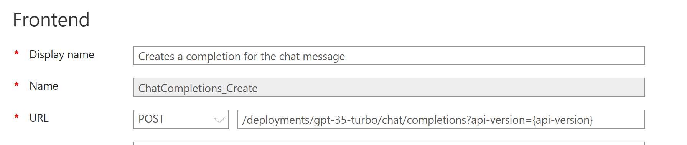
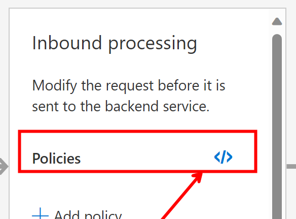

# Azure API Management (APIM)
I have used plenty of URL rewriters in the past but this one is pretty amazing. Add the capabilies of this solution with App Insights and Log Analytics, you have a very complex machine at your fingertips.

# Updates
- 🆙 2024-06-04
    - Updated to include the backends and circuit breakers
        > This took some testing and care but it works like a champ
    - Moving the previous version to `OLD` like me

# So you want to avoid these 429 errors?
Since Azure OpenAI came out, we have had to create retry logic from within applications or in the backend to help us make sure we don't hit 429 errors. By chaining together multiple regions in a geography, we can get a lot of TPM easily and spread the love. If you don't need to deal with Data Sovereignty issues, you can spread the love all over the world

## APIM for Azure OpenAI
I have included some basics on how to implement this type of a solution in your environment. Hopefully this can be a building block to something very robust.

### Build out your Azure OpenAI resource
You will want to get as much TPM as possible across regions. 

1. Create deployments for the models and name them the same
    - Ex: `gpt-35-turbo`
    > If you want to create them with each version go for it
1. Make sure to set the TPM to the desired amount for Dev->Test->Prod

### Create the APIM resources
1. Create your APIM resource
1. Import the **Azure OpenAI Service API** into your solution
    - Follow [these](https://learn.microsoft.com/en-us/azure/api-management/import-api-from-oas?tabs=portal) directions and switch it up 
1. Setup `Managed Identity` on the APIM service
1. Add the MI to each AOAI Endpoint as a `Cognitive Services OpenAI User`
    - Code to do this quickly
    ```
    # 
    @subscriptionId=999999-999999-99999
    @resourceGroupName=rg-dai-dev-use
    @serviceName=apim-dai-dev-use

    ### Get the principal id
    # @name service
    GET https://management.azure.com/subscriptions/{{subscriptionId}}/resourceGroups/{{resourceGroupName}}/providers/Microsoft.ApiManagement/service/{{serviceName}}?api-version=2023-03-01-preview
    Content-Type: application/json
    Authorization: {{$aadToken tenantId}}

    ### Get the role assignments for the principalId
    @principalId={{service.response.body.$.identity.principalId}}
    GET https://management.azure.com/subscriptions/{{subscriptionId}}/providers/Microsoft.Authorization/roleAssignments?api-version=2022-04-01&$filter=principalId eq '{{principalId}}'
    Content-Type: application/json
    Authorization: {{$aadToken tenantId}}

    ### Assign principalId
    @loc="scus"
    PUT https://management.azure.com/subscriptions/{{subscriptionId}}/resourceGroups/rg-dai-dev-{{loc}}/providers/Microsoft.CognitiveServices/accounts/aoai-dai-dev-{{loc}}/providers/Microsoft.Authorization/roleAssignments/{{$guid}}?api-version=2022-04-01
    Content-Type: application/json
    Authorization: {{$aadToken tenantId}}

    {
        "properties": {
            "roleDefinitionId": "/subscriptions/{{subscriptionId}}/providers/Microsoft.Authorization/roleDefinitions/5e0bd9bd-7b93-4f28-af87-19fc36ad61bd",
            "principalId": "{{principalId}}"
        }
    }
    ```
1. Create an `Operation` for each model/version
    - Why would you do this? Simplify logic. Maybe you only have 1-3 regions for GPT4 and have 6 for GPT35. Keep the logic simple
    - In this walkthrough we wil use `gpt-35-turbo`
1. Set the policy for the operation
    - Make sure to set the `Frontend` correctly
    
    
1. Create the `backend` for each endpoint
    > Note: We are using Managed Identity here so hang in there
    ```html

    ### Create a Backend for eastus
    # Trip where there is count=1 429 and wait for 1 minute before trying again
    PUT https://management.azure.com/subscriptions/{{subscriptionId}}/resourceGroups/{{resourceGroupName}}/providers/Microsoft.ApiManagement/service/{{serviceName}}/backends/aoai-eastus?api-version=2023-09-01-preview
    Content-Type: application/json
    Authorization: {{$aadToken tenantId}}

    {
        "properties": {
            "description": "Backend for AOAI eastus",
            "url": "{{$dotenv AOAI_ENDPOINT_eastus}}openai",
            "protocol": "http",
            "circuitBreaker": {
                "rules":[
                    {
                        "failureCondition":{
                            "count":1,
                            "errorReasons": [
                                "Server errors"
                            ],
                            "interval": "PT1S",
                            "statusCodeRanges":[
                                {
                                    "min":429,
                                    "max":429
                                }
                            ]
                        },
                        "name":"breakerRule",
                        "tripDuration":"PT1M",
                        "acceptRetryAfter": true
                    }
                ]
            }
        }
    }
    ```
1. Create the circuit breaker for `aoai-lb-us`
    > NOTE: Doing this by geography for Data Sovereignty like the `us` in this case
    ```text
    ### Create a Backend Circuit Breaker
    PUT https://management.azure.com/subscriptions/{{subscriptionId}}/resourceGroups/{{resourceGroupName}}/providers/Microsoft.ApiManagement/service/{{serviceName}}/backends/aoai-lb-us?api-version=2023-09-01-preview
    Content-Type: application/json
    Authorization: {{$aadToken tenantId}}

    {
        "properties": {
            "description": "Load balancer for AOAI US Geography",
            "type":"Pool",
            "pool": {
                "services":[
                    {
                        "id":"/subscriptions/{{subscriptionId}}/resourceGroups/{{resourceGroupName}}/providers/Microsoft.ApiManagement/service/{{serviceName}}/backends/aoai-eastus",
                        "priority":"1",
                        "weight":"1"
                    },
                    {
                        "id":"/subscriptions/{{subscriptionId}}/resourceGroups/{{resourceGroupName}}/providers/Microsoft.ApiManagement/service/{{serviceName}}/backends/aoai-eastus2",
                        "priority":"2",
                        "weight":"1"
                    },
                    {
                        "id":"/subscriptions/{{subscriptionId}}/resourceGroups/{{resourceGroupName}}/providers/Microsoft.ApiManagement/service/{{serviceName}}/backends/aoai-northcentralus",
                        "priority":"2",
                        "weight":"2"
                    },
                    {
                        "id":"/subscriptions/{{subscriptionId}}/resourceGroups/{{resourceGroupName}}/providers/Microsoft.ApiManagement/service/{{serviceName}}/backends/aoai-southcentralus",
                        "priority":"3",
                        "weight":"1"
                    }

                ]
            }

        }
    }
    ```
    - Think of `priority` of 1 as a PTU if you have one and then everything else as PAYGO

1. Modify the policy at the root
    - Modify the policy and se the code in [apim-aoai-backend](apim-aoai-backend.xml)
    ```xml
    <policies>
        <inbound>
            <base />
            <set-backend-service backend-id="aoai-lb-us" />
            <!-- You may need to add logic for the deploymentid -->
            <!-- Backend Managed Identity -->
            <authentication-managed-identity resource="https://cognitiveservices.azure.com" output-token-variable-name="managed-id-access-token" ignore-error="false" />
            <set-header name="Authorization" exists-action="override">
                <value>@("Bearer " + (string)context.Variables["managed-id-access-token"])</value>
            </set-header>
        </inbound>
        <backend>
            <retry condition="@(context.Response.StatusCode == 429)" count="2" interval="1" first-fast-retry="true">
                <set-backend-service backend-id="aoai-lb-us" />
                <forward-request buffer-request-body="true" buffer-response="false" />
            </retry>
        </backend>
        <outbound>
            <base />
        </outbound>
        <on-error>
            <base />
        </on-error>
    </policies>    
    ```
1. Test the heck out of this
    - Set the TPM of the deployment for the first one to 1 TPM
        - Yup, that is right, we want to force a 429
        - If you are feeling compelled, set the other ones to low amounts too and see what happens
    - Use the [Load Tester](load-tester.ps1)
        - Hammer time
    - Use the handy dandy [REST Client extension](https://marketplace.visualstudio.com/items?itemName=humao.rest-client) and test this
    ```text
    ### Send request with trace
    POST {{$dotenv APIM_ENDPOINT}}openai/deployments/gpt-35-turbo/chat/completions?api-version=2023-07-01-preview
    Content-Type: application/json
    api-key: {{$dotenv APIM_KEY}}
    Ocp-Apim-Trace: true

    {"model":"gpt-35-turbo","messages":[{"role":"user","content":"Tell me a joke"}]}
    ```
    - Check the `x-ms-region: South Central US`. This is the LAST location used in the retry logic
        > So if you force it to start in `East US` this will show that it then ended up in `South Central US`
    - I included the `Ocp-Apim-Trace` as this is VERY useful to see the details of exactly what is going on. Follow the steps in the APIM documentation for enabling [Tracing](https://learn.microsoft.com/en-us/azure/api-management/api-management-howto-api-inspector)

# Old Way
### Create the APIM resources
1. Create your APIM resource
1. Import the **Azure OpenAI Service API** into your solution
    - Follow [these](https://learn.microsoft.com/en-us/azure/api-management/import-api-from-oas?tabs=portal) directions and switch it up 
1. Create named `Named values` with all your endpoints and keys
    - endpoint shoud end with the `/`
1. Create a `Policy fragment` for each model/version
    - Use the code in [apim-fragment](apim-aoai-fragment.xml)
    - For this one, name it `gpt-35-turbo-deployments`
1. Create an `Operation` for each model/version
    - Why would you do this? Simplify logic. Maybe you only have 1-3 regions for GPT4 and have 6 for GPT35. Keep the logic simple
    - In this walkthrough we wil use `gpt-35-turbo`
1. Set the policy for the operation
    - Make sure to set the `Frontend` correctly
    
    
    - Modify the policy and se the code in [apim-aoai-policy](apim-aoai-policy.xml)
    ```xml
    <policies>
        <inbound>
            <!--Setup the url-->
            <include-fragment fragment-id="gpt-35-turbo-deployments" />
            <!--Create a copy to use for all the returns-->
            <set-variable name="backendUrl" value="@((string)context.Variables["url"])" />
            <set-backend-service base-url="@((string)context.Variables["url"])" />
        </inbound>
        <backend>
            <retry condition="@(context.Response.StatusCode == 429)" count="30" interval="4" delta="2" max-interval="20" first-fast-retry="true">
                <!--Setup the url-->
                <include-fragment fragment-id="gpt-35-turbo-deployments" />
                <set-backend-service base-url="@((string)context.Variables["url"])" />
                <forward-request buffer-request-body="true" />
            </retry>
        </backend>
        <outbound>
            <set-header name="Backend-Service-URL" exists-action="override">
                <value>@((string)context.Variables["backendUrl"])</value>
            </set-header>
        </outbound>
        <on-error>
            <base />
        </on-error>
    </policies>
    ```
1. Test the heck out of this
    - Override one of the endpoints in the fragment and use it as a force to start with
        - Uncomment out this line `<set-variable name="urlId" value="@(6)" />`
        - Comment out the `Random` line
        - This will for the logic to ALWAYS use the first one
    - Set the TPM of the deployment for the first one to 1 TPM
        - Yup, that is right, we want to force a 429
        - If you are feeling compelled, set the other ones to low amounts too and see what happens
    - Use the [Load Tester](load-tester.ps1)
        - Hammer time
    - Use the handy dandy [REST Client extension](https://marketplace.visualstudio.com/items?itemName=humao.rest-client) and test this
    ```text
    ### Send request with trace
    POST {{$dotenv APIM_ENDPOINT}}openai/deployments/gpt-35-turbo/chat/completions?api-version=2023-07-01-preview
    Content-Type: application/json
    api-key: {{$dotenv APIM_KEY}}
    Ocp-Apim-Trace: true

    {"model":"gpt-35-turbo","messages":[{"role":"user","content":"Tell me a joke"}]}
    ```
    - Check the `x-ms-region: South Central US`. This is the LAST location used in the retry logic
        > So if you force it to start in `East US` this will show that it then ended up in `South Central US`
    - I included the `Ocp-Apim-Trace` as this is VERY useful to see the details of exactly what is going on. Follow the steps in the APIM documentation for enabling [Tracing](https://learn.microsoft.com/en-us/azure/api-management/api-management-howto-api-inspector)