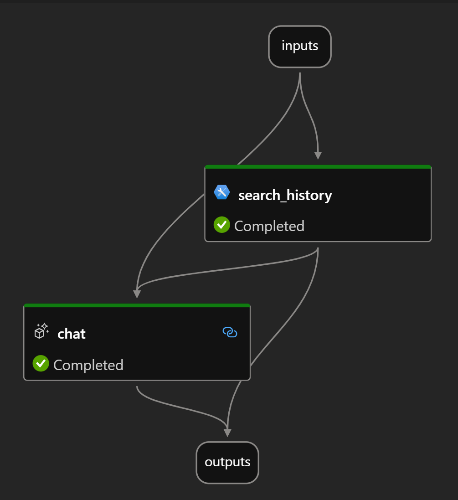

# Prompt flow
There are so many ways to use prompt flow it is crazy. If you haven't used it, take a look at the following references and get ready to fall in love 🥰

- https://microsoft.github.io/promptflow
- https://github.com/microsoft/promptflow
- Watch this session from Ignite [BRK203: End-to-End AI App Development](https://www.youtube.com/watch?v=DdOylyrTOWg) and the code from [here]
(https://github.com/microsoft/contoso-support-pf-demo)

This only covers the basics but there are so many ways to test, evaluate and compare using variants that it would take a lot of work

## Prerequisites
1. Create a conda environment and install the modules needed
```bash
    conda create -n pflow python=3.8
    conda activate pflow
    pip install promptflow promptflow-tools
```

1. (_Optional_) Install and configure [Prompt flow for VS Code extension](https://marketplace.visualstudio.com/items?itemName=prompt-flow.prompt-flow) follow [Quick Start Guide](https://microsoft.github.io/promptflow/how-to-guides/quick-start.html). (_This extension is optional but highly recommended for flow development and debugging._)

# Bing it sample using prompt flow
Prompt flow is a great way to run models and is even more amazing when it comes to code first solutions and to quickly build LLM interactions. This sample builds from my widely referenced `bing it` python solution that uses the Bing API.

New to this solution is the use of the [SERP API](https://serpapi.com) which runs to gather information from the web and then takes this content in injects it into the prompt.



## Walkthrough
1. The `input` takes a **question** as type `string` and a **chat_history** as type `list`
1. `search_history` is used to call into the SERP API with the **question** 
1. The **question** and the output from `search_history` are sent to `chat` which uses a jinga template to render the LLM prompt and call into Azure OpenAI
1. The **answer** from the `chat` and and JSON from the `search_history` as exposed in the `output`

## Prerequisites
You will need an Azure OpenAI resource and a SERP account to run this.

1. Deploy an Azure OpenAI chat model (e.g. gpt35 or any of the other gpt models). Follow the [how-to](https://learn.microsoft.com/en-us/azure/ai-services/openai/how-to/create-resource?pivots=web-portal) for an Azure OpenAI example.
    - Make sure to grab the endpoint and the key for the service
1. Register for a free key at https://SerpAPI.com and grab the key from the dashboard
    - There are so many use cases for this but we will just use the Bing search capabilities for now

## Run streamlit app
1. Clone or fork this repo
    - `git clone https://github.com/kirkhofer/data-ai.git`
1. (_Optional_) Create a `.env` file with the following
    ```text
    AOAI_ENDPOINT=https://azure-resource-name.openai.azure.com/
    AOAI_KEY=99999999999
    SERP_KEY=9999a2439
    ```
    - If you don't do this, the application will prompt for those. This just saves time and I am lazy and don't like to continually update this stuff
1. Move into this folders `cd pflow`
1. Install dependencies
    ```bash
   pip install -r requirements.txt
    ```
1. Execute the Streamlit app `streamlit run serp-it.py`
1. Enter the endpoint and keys and test it out
